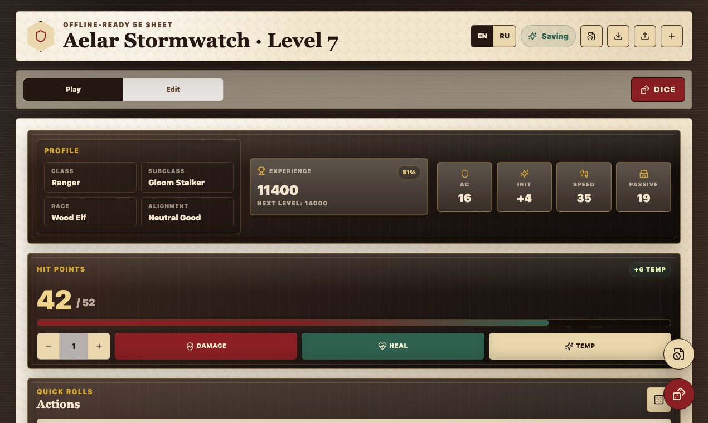
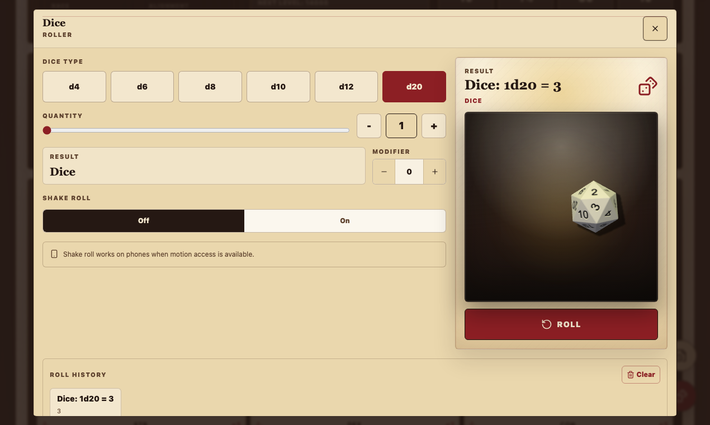
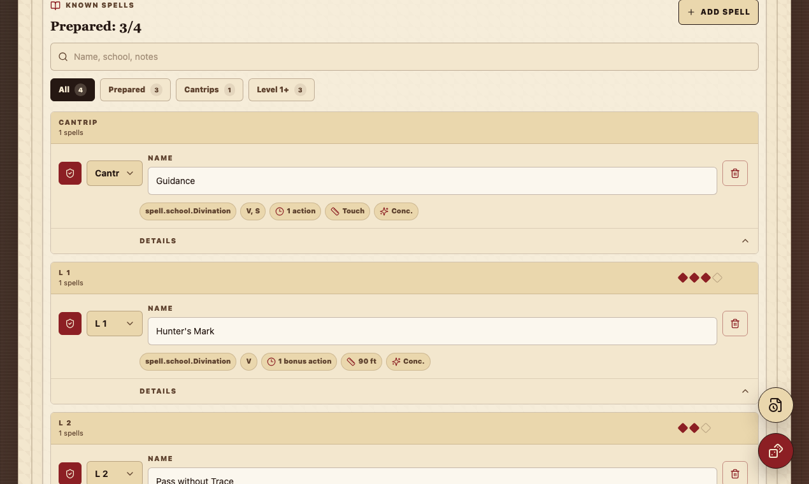

# Quest Ledger

Quest Ledger is a local-first DnD 5e-compatible character sheet for live tabletop sessions. It keeps the parts you touch during play close at hand: HP, resources, spells, inventory, dice, history snapshots, and portable backups.

The app runs entirely in the browser. Characters are saved locally, can be exported as JSON, and the site can be installed as a PWA on a phone for offline play after the first load.

## Live App

https://yudin-s.github.io/dnd-character-vault/

## Screenshots



| Dice roller | Spellbook |
| --- | --- |
|  |  |

## Features

- Session-first play mode with HP, XP, resources, death saves, conditions, and quick rolls.
- Full edit mode for identity, abilities, skills, combat, inventory, spells, and notes.
- Built-in 3D dice roller powered by `@3d-dice/dice-box-threejs`.
- Spellbook with slots, prepared spells, filters, components, casting details, and notes.
- Inventory with equipped gear, weapons, armor, shields, coins, item counters, and weapon rolls.
- Local autosave history with restore points.
- JSON export/import for portable backups.
- Installable PWA/SPA for phone use and offline sessions.
- No account, backend, or cloud sync required.
- English and Russian UI dictionaries.

## Local-First Data

Quest Ledger stores data in the user's browser through `localStorage`.

Saved locally:

- Current character sheet.
- Local history snapshots.
- Selected UI language.
- App shell cache through the service worker.

Not sent anywhere:

- Character data.
- Dice history.
- Backups.

Browser storage can still be cleared by the user or browser. Export JSON backups before switching devices or clearing site data.

## Install As App

Open the live site over HTTPS, then install it from the browser menu or the in-app install prompt. After the first successful load, the service worker caches the app shell so it can reopen offline.

## Tech Stack

- Next.js app router with static export.
- React.
- Tailwind CSS.
- Lucide icons.
- `@3d-dice/dice-box-threejs` for 3D dice.
- GitHub Pages deployment.

## Development

```bash
cd dnd-character-vault
npm install
npm run dev
```

Then open the URL printed by Next.js, usually `http://localhost:3000`.

## Static Build

```bash
cd dnd-character-vault
npm run build
```

The static output is written to `dnd-character-vault/out`.

For GitHub Pages under the current repository subpath:

```bash
cd dnd-character-vault
NEXT_PUBLIC_BASE_PATH=/dnd-character-vault npm run build
```

## Project Layout

- `dnd-character-vault/app/` - Next.js app router entry points and global CSS.
- `dnd-character-vault/src/components/` - React UI components.
- `dnd-character-vault/src/hooks/` - local state, dice, locale, and PWA hooks.
- `dnd-character-vault/src/lib/` - character schema, 5e math, dice helpers, and storage.
- `dnd-character-vault/public/` - PWA manifest, service worker, icons, and dice textures.
- `docs/product-hunt/` - launch copy, gallery screenshots, and Product Hunt assets.
- `scripts/` - screenshot capture tooling for launch assets.

## Product Hunt

Launch copy and asset checklist live in [docs/product-hunt/launch-kit.md](docs/product-hunt/launch-kit.md).

Gallery assets are documented in [docs/product-hunt/assets/README.md](docs/product-hunt/assets/README.md).

## Legal

Quest Ledger is an unofficial 5e-compatible utility. It does not include official Dungeons & Dragons branding assets, third-party art, or copyrighted rulebook text.

## License

MIT License. See [LICENSE](LICENSE).
